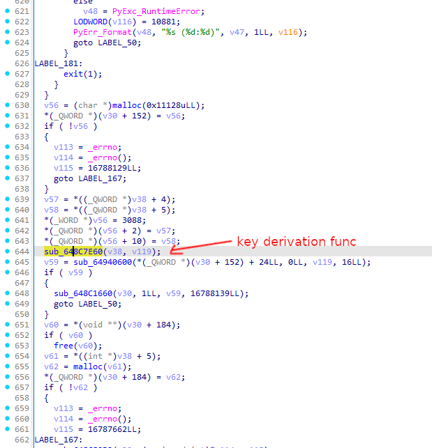

# Pyarmor v8+ tooling

This repository contains some scripts for statically decrypting Python scripts protected with Pyarmor v8 or higher.

Blog post for further reading: https://cyber.wtf/2025/02/12/unpacking-pyarmor-v8-scripts/

Please also take note of the [Disclaimer](#disclaimer) section below before you continue.

## Usage

Initial preparation: Go into `py312` and run `docker build -t pyarmor312 .`. Also create a virtual env where you install `pycryptodome`.

1. Open up the native Pyarmor module in IDA, find the MD5 key derivation function, adjust `ida_getkey.py` and run it in IDAPython. Adjust `decrypt_gcm.py` with the key you obtained. Alternatively, a Binary Ninja version of the script is available (`bn_getkey.py`).
1. Run `python decrypt_gcm.py /path/to/malware/malware.py`
1. Run `docker run --rm -u $(id -u):$(id -g) -v $(pwd)/analyze_crypted_code.py:/script.py:ro -v /path/to/malware:/data -it pyarmor312 /script.py /data/malware.py.dec`
1. Run `python decrypt_gcm.py /path/to/malware/malware.py.dec` - it will now use the json file generated by the step above to decrypt individual functions and generate a `dec2` file
1. Run `docker run --rm -u $(id -u):$(id -g) -v $(pwd)/disassemble.py:/script.py:ro -v /path/to/malware:/data -it pyarmor312 /script.py /data/malware.py.dec2`, which will fully disassemble the Python bytecode


## Finding the key derivation function

Go to the PyInit export and scroll almost all the way down, until you see a place like this:



Inside that function you'll find the necessary details for `ida_getkey.py`.


## BCC mode

If the script you're analyzing is protected with BCC mode, step 2 will additionally yield an ELF file (`.dec.elf`).
This ELF contains Python functions that were compiled to native code.

You can use the `bcc_info.py` script with the custom Python interpreter for obtaining further details about the BCC functions.
That includes:
* Function offsets in the ELF
* Suggested function names
* List of constants used by the native code

This information is also written to a json file, which can be used with the IDAPython script `ida_annotate_bcc.py` in order to import the data into IDA.

**Note:** The ELF format is only followed in the broadest strokes, and IDA may refuse to load the file as ELF. In that case, simply load it as binary file. For Windows targets, you should make sure to set the compiler to Visual C++ so that the correct ABI will be used.


You may find the following reverse engineered definitions (Pyarmor v9, Python 3.11/3.12) helpful when looking at BCC code:
```c
enum GLOBAL_OPS
{
  GLOBAL_DELETE = 0x0,
  GLOBAL_GET = 0x1,
  GLOBAL_RETURN_GLOBALS = 0x2,
  GLOBAL_SPECIAL_ENTER = 0x4, /* __enter__ */
  GLOBAL_SPECIAL_EXIT = 0x5, /* __exit__ */
  GLOBAL_SET_MIN = 0x10, /* anything above means Set (pointer value instead of int) */
};

struct bcc_ftable
{
  _QWORD p_stdin;
  void (__fastcall *memset)(void *, _QWORD, _QWORD);
  _QWORD p_stderr;
  _QWORD fprintf;
  void *(__fastcall *PyNumber_operator)(void *a, void *b, int operatortype);
  __int64 (*build_collection)(__int64 colltype, __int64 count, ...);
  __int64 *(__fastcall *call_python_func)(__int64 bDontCall, __int64 *pyCallable, int bArgsRequired, int bKwArgsRequired, __int64 *argsTuple, __int64 *kwargsDict);
  int (__fastcall *set_exception_if_none_was_raised)(int mode);
  void *(__fastcall *comparison)(void *unused, int operatortype, void *left, void *right);
  _QWORD qword48;
  _QWORD fetch_exception;
  _QWORD string_format;
  void *(__fastcall *globals_operation)(void *unused, void *key, GLOBAL_OPS modeOrValueForSet);
  _QWORD op_mkfunc_not_available;
  void *(__fastcall *iter_next)(void *);
  _QWORD qword78;
  _QWORD qword80;
  _QWORD update_exception_info;
  _QWORD qword90;
  __int64 (__fastcall *unpack_values)(void *unused, void *input, int maxCount, void **output);
  _QWORD qwordA0;
  _QWORD new_function;
  _QWORD qwordB0;
  _QWORD import_stuff;
  _BYTE gapC0[32];
  _QWORD Py_NoneStruct;
  _QWORD Py_TrueStruct;
  _QWORD Py_FalseStruct;
  _QWORD gapF8;
  int (__fastcall *PyBytes_AsStringAndSize)(void *obj, char **buffer, _QWORD *length);
  void *(__fastcall *PyCell_Get)(void *cell);
  void *(__fastcall *PyCell_New)(void *ob);
  int (__fastcall *PyCell_Set)(void *cell, void *value);
  void (__fastcall *PyErr_Clear)();
  void *(__fastcall *PyErr_Occurred)();
  void (__fastcall *PyErr_SetObject)(void *type, void *value);
  void *(__fastcall *PyEval_GetGlobals)();
  void *(__fastcall *PyImport_ImportModule)(const char *name);
  void *(__fastcall *PyImport_ImportModuleLevel)(const char *name, void *globals, void *locals, void *fromlist, int level);
  int (__fastcall *PyList_Append)(void *list, void *item);
  void *(__fastcall *PyList_New)(__int64 len);
  void *(*PyObject_CallFunction_SizeT)(void *callable, const char *format, ...);
  void *(*PyObject_CallFunctionObjArgs)(void *callable, ...);
  void *(*PyObject_CallMethod_SizeT)(void *obj, const char *name, const char *format, ...);
  int (__fastcall *PyObject_DelItem)(void *, void *key);
  void *(__fastcall *PyObject_GetAttr)(void *, void *attr_name);
  void *(__fastcall *PyObject_GetItem)(void *, void *key);
  void *(__fastcall *PyObject_GetIter)(void *);
  int (__fastcall *PyObject_IsTrue)(void *);
  int (__fastcall *PyObject_SetAttr)(void *, void *attr_name, void *v);
  int (__fastcall *PyObject_SetItem)(void *, void *key, void *v);
  int (__fastcall *PySet_Add)(void *, void *key);
  void *(__fastcall *PySet_New)(void *iterable);
  void *(__fastcall *PySlice_New)(void *start, void *stop, void *step);
  void *(__fastcall *PyTuple_GetItem)(void *p, __int64 pos);
  void (__fastcall *Py_DecRef)(void *);
  void (__fastcall *Py_IncRef)(void *);
};
```


# Custom Python notes

The Docker image builds a custom Python version that is able to read objects serialized by Pyarmor.

The difference to 'normal' Python is that code objects have an additional string/array at the end.
Since the normal unmarshaler doesn't expect this, it runs into an "unknown type" error.

The patch introduces an `armor` flag into `RFILE` so that we can only apply the changed logic for explicit calls to `marshal.load(file: SupportsRead[bytes])`.
Otherwise, Python breaks because it cannot unmarshal its builtin objects.

**If you have a protected version that utilizes a different Python version, you need to build that specific version and possibly adjust the patch.**


# Disclaimer

This repository contains tools developed by G DATA Advanced Analytics GmbH intended strictly for malware analysis and related security research. 

**Important Notice**
- These tools are designed for legitimate purposes only, such as analyzing malicious software in controlled environments.
- Use of these tools for any unauthorized or illegal activities, including the analysis of non-malicious software, is strictly prohibited.
- Users are solely responsible for ensuring compliance with all applicable local, national, and international laws and regulations.

**No Warranty**

This software is provided "as is", without warranty of any kind, express or implied, including but not limited to the warranties of merchantability, fitness for a particular purpose, and non-infringement. In no event shall the authors or copyright holders be liable for any claim, damages, or other liability arising from, out of, or in connection with the software or the use or other dealings in the software.

By using this software, you agree to these terms.
